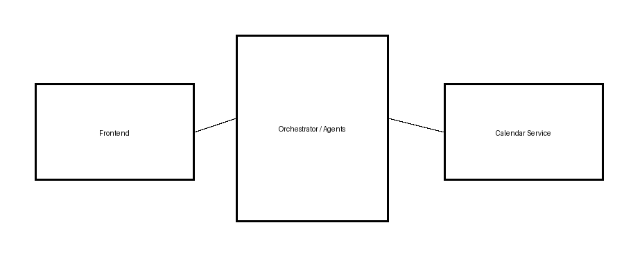
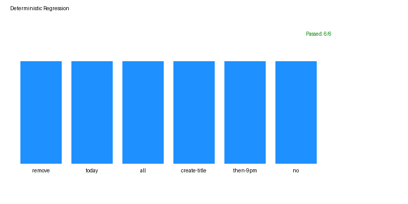

# Axon — Agentic Calendar System

A conversational agent that manages your Google Calendar in plain English. It understands intent, structures and prioritizes your day, detects conflicts, finds free slots, and proposes create / reschedule / delete actions — but **never touches your real calendar without explicit approval**, thanks to a human-in-the-loop (HITL) gate.

Built with a **FastAPI** backend, a **Streamlit** frontend, and **Groq (Llama 3.1)** for LLM reasoning.

> **Try it:** `"what's for today"` · `"show conflicts"` · `"free slots"` · `"move gym to 8pm"` · `"delete lunch"`

---

## Why it's built this way

| Design choice | What it buys you |
|---|---|
| **HITL approval gate** (`/execute` queues, `/approve` applies) | The LLM can *propose* but never *commit*. Every mutation is shown to the user before it reaches the calendar — no silent, hallucinated edits. |
| **Multi-agent pipeline** | Intent, entity, planning, prioritization, and execution are separate, testable agents instead of one mega-prompt — easier to debug and extend. |
| **Optional API-key auth** | The mutation API is locked behind an `X-API-Key` header when `API_KEY` is set (constant-time compare), with a loud startup warning if it's left open. |
| **Demo mode** | Swap Google Calendar for an in-memory mock — anyone can try the full chat → plan → approve → execute loop with zero setup. |
| **Deterministic regression tests** | 6 end-to-end conversation cases run on every push via GitHub Actions, so behavior changes can't slip through silently. |

---

## Architecture

```
User ↔ Streamlit (frontend/app.py)
            │  HTTP (API_URL, optional X-API-Key)
            ▼
       FastAPI (backend/app/main.py)
            │
   ┌────────┴─────────┐
   │   Orchestrator    │  intent/entity detection → router → workflow
   └────────┬─────────┘
            │
   ┌────────┴─────────┐
   │      Agents       │  planner · prioritizer · execution (Groq LLM)
   └────────┬─────────┘
            │
   ┌────────┴─────────┐
   │ Calendar Service  │  Google Calendar API  — or —  in-memory mock (DEMO_MODE)
   └───────────────────┘
```



**Layout**
- `backend/` — FastAPI app: agents (intent, entity, planner, prioritizer, execution), orchestrator (router, workflow, context builder), memory, and tests.
- `frontend/` — Streamlit UI for chat and approvals.
- `tools/` — helper scripts (architecture/regression graph generation).

---

## Local Setup

**1. Configure environment**

```bash
cp .env.example .env
```

Key variables:
- `GROQ_API_KEY` — required; free key at https://console.groq.com
- `DEMO_MODE=true` — run against the mock calendar (no Google setup)
- `API_KEY` — set it to require an `X-API-Key` header on every endpoint (recommended for any non-local deployment)
- `ALLOWED_ORIGINS` — comma-separated CORS allowlist (defaults to localhost)

**2. Real Google Calendar** (`DEMO_MODE=false`)

1. Create an OAuth client ID (Desktop app) in Google Cloud Console with the Calendar API enabled.
2. Download it as `backend/credentials.json`.
3. First run opens a browser to authorize; a `token.json` is saved for reuse.

This OAuth flow is interactive and local-only — it won't run on a headless cloud server. Use `DEMO_MODE=true` for cloud deployments.

**3. Run backend + frontend**

```bash
source venv39/bin/activate

# backend → http://127.0.0.1:8000
cd backend && python -m uvicorn app.main:app --reload --app-dir .

# frontend → http://localhost:8501  (set API_URL to point elsewhere)
cd frontend && python -m streamlit run app.py
```

---

## Tests

```bash
source venv39/bin/activate
cd backend
python -m app.testing.testing_chat_regression
```

Expected: `Regression result: 6/6 passed`. The same suite runs on every push/PR via GitHub Actions (`.github/workflows/ci.yml`).



---

## Deployment

**Docker (any container host)**

```bash
GROQ_API_KEY=your_key DEMO_MODE=true docker compose up --build
```

Backend on `:8000`, frontend on `:8501`.

**Cloud (recommended split)**
- **Backend** → Render / Railway / Fly.io: deploy `backend/` (or its `Dockerfile`); set `GROQ_API_KEY`, `DEMO_MODE`, `API_KEY`, and `ALLOWED_ORIGINS=https://<your-frontend-domain>`.
- **Frontend** → Streamlit Community Cloud: deploy `frontend/app.py`; set the `API_URL` secret (and matching `X-API-Key`) to your backend.

---

## Known limits
- Session memory is file-backed — migrate to Redis for multi-instance deployments.
- Demo state is in-memory and shared across all visitors by design (fine for a portfolio demo, not multi-tenant use).
- Targets Python 3.9 (`venv39`); Google libraries warn about 3.9 EOL — upgrading to 3.10+ is recommended.
